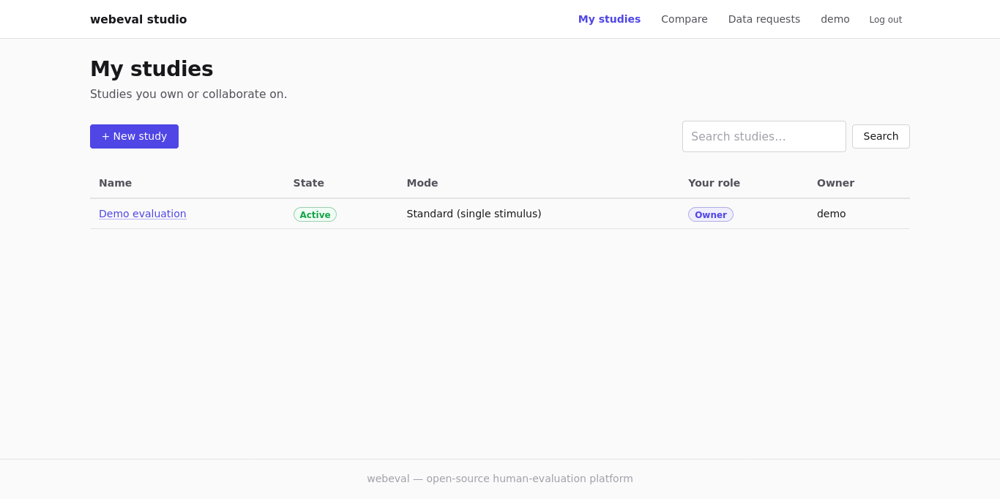
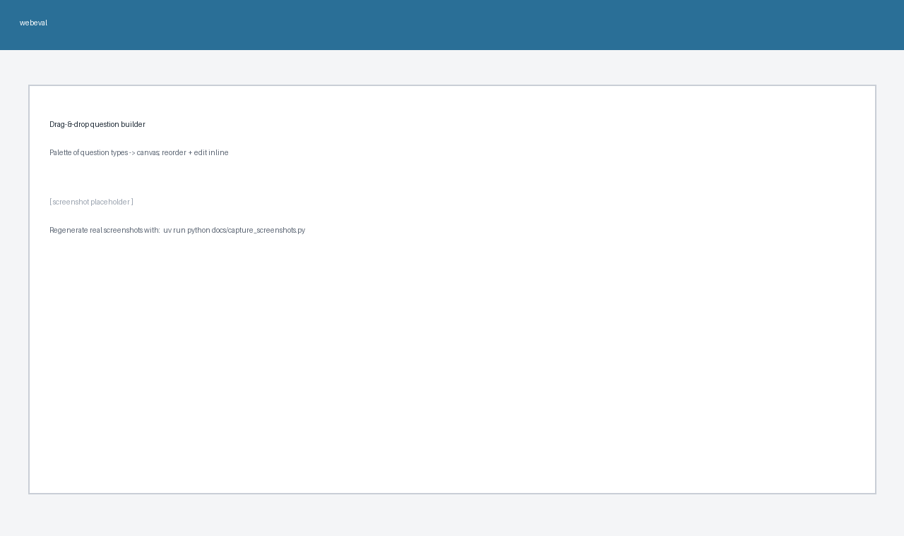
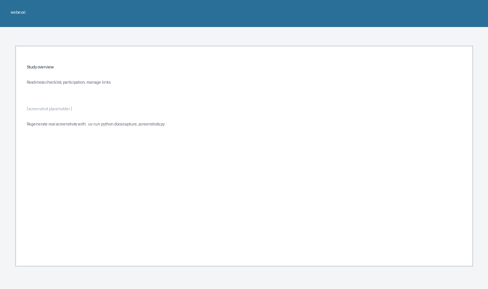
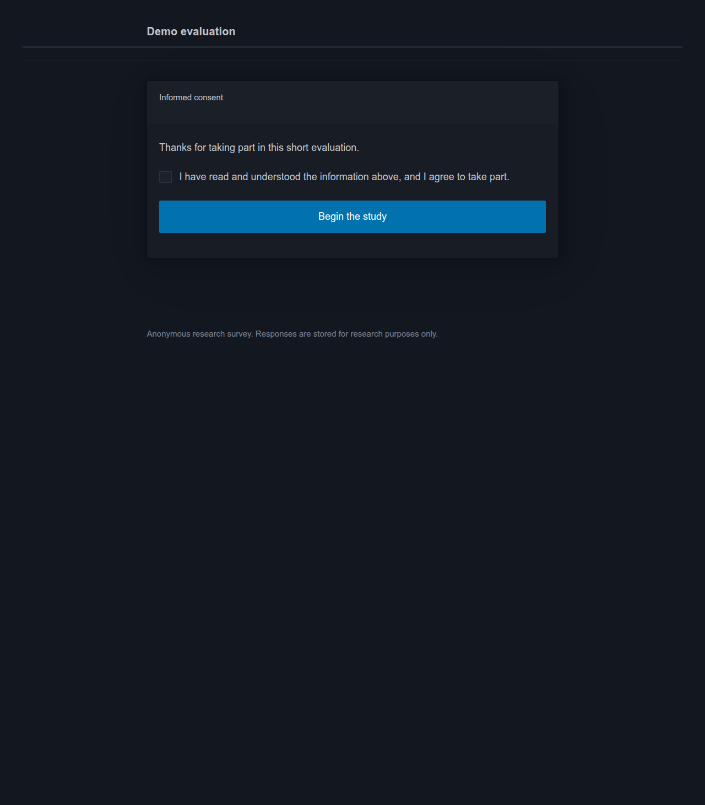
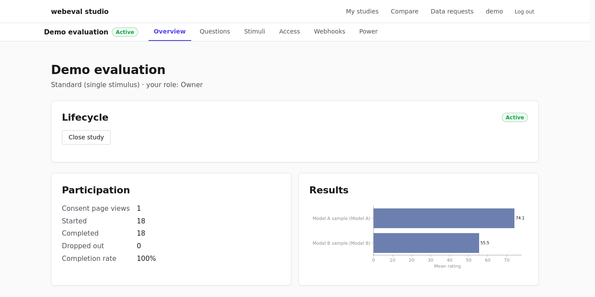

# Using PANEL

This walkthrough follows a study from creation to results. There are two surfaces:

- the **studio** (`/studio/`) — the researcher dashboard where you do day-to-day work;
- the **participant flow** (`/s/<slug>/`) — what the people you're evaluating with see.

> The screenshots below live in [`docs/screenshots/`](screenshots/). If you're viewing a fresh checkout and they look like placeholders, regenerate them with the bundled capture script — see [Generating the screenshots](#generating-the-screenshots).

## 1. Sign in and the studio

Register at `/accounts/register/` (or have an admin invite you) and land on the studio. It lists every study you own or collaborate on, with quick links to create a new one, **compare studies**, and handle **data-subject requests**.



## 2. Create a study

**New study** gives you a draft you own. A study has a lifecycle:

**draft → test → active → closed**

- **draft** — build it; structural edits are only allowed here.
- **test** — rehearse the real participant flow; sessions started in test are kept *out* of your results.
- **active** — collecting real data.
- **closed** — finished.

## 3. Build the questionnaire (drag & drop)

Open the study's **builder** to assemble questions visually: drag a type from the palette (built-ins *and* any [plugins](plugins.md)) onto the canvas, reorder by dragging, edit each inline, and save. No Django admin needed — editors can do this too.



Conditions and stimuli (the things participants evaluate) are authored in the Django admin, linked from the study page. A study can mix audio, video, image, text, raw-HTML, and embedded-URL stimuli.

## 4. Check readiness and go live

The study overview shows a **readiness checklist** — PANEL blocks activation until the study is complete enough to collect usable data (≥1 condition, an active stimulus, a per-stimulus question, consent text, …). Switch to **test** to preview, then **activate**.



## 5. The participant experience

Share the study's `/s/<slug>/` link (there's no public index of studies). Participants get a clean, mobile-friendly, mostly-JS-free flow: consent → optional screening → instructions → the stimuli/questions → optional demographics → a thank-you page (with a completion code if you use one). Studies can be branded per-study (accent colour, logo, custom CSS).



## 6. Watch and analyse results

The overview shows live results **per question** for every question type — choice/Likert distributions, rating/numeric summary stats, matrix breakdowns, ranking mean-ranks — plus ready-to-use **across-condition tests** (one-way ANOVA / chi-square with p-values) and **segmentation** by device, country, condition, or cohort. Each question also reports the median time spent on its page.



Beyond a single study, the studio offers a **cross-experiment comparison** table and a **power / sample-size** calculator (which can estimate effect size and required n from your pilot data).

## 7. Get the data out

- **CSV** — long-format answers, wide demographics, completion codes, pairwise answers, and the raw event log (all from the overview; PII redacted unless you opt in).
- **JSON / REST API** — pull aggregate results or submitted answers programmatically with a scoped [API key](../README.md#api-keys).
- **Webhooks** — have PANEL POST to your pipeline on completion (see [plugins](plugins.md#3-consuming-webhooks)).
- **Reproducibility** — printable HTML, JSON, and ZIP archives of the study design.

## 8. Privacy & data governance

Per-study compliance metadata (IRB #, lawful basis, retention window), consent-version stamping, retention sweeps, an audit trail, and the data-subject-request tool are all built in — see [GDPR & privacy](gdpr.md).

---

## Generating the screenshots

The images above are produced by a Selenium script that seeds a demo study, runs the dev server, and captures each page:

```bash
uv run python docs/capture_screenshots.py
```

It needs a Chromium/Chrome (or Firefox) browser available to Selenium and writes PNGs into `docs/screenshots/`. The script is deterministic and safe to re-run; it uses a throwaway temporary database and never touches your real data. See the comments at the top of [`docs/capture_screenshots.py`](capture_screenshots.py) for browser configuration.
